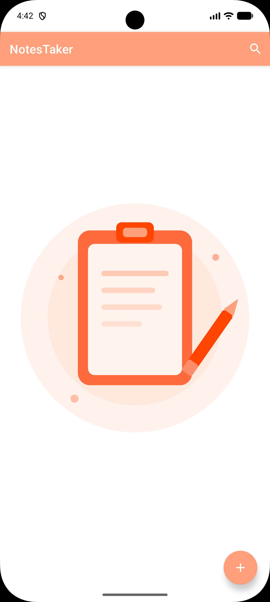
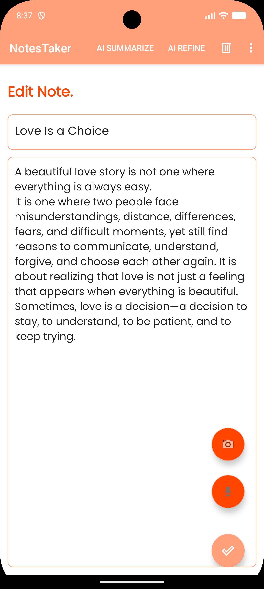

# NotesTaker

NotesTaker is a simple, modern, and efficient Android application designed for quick note-taking. It leverages cutting-edge AI and immersive design to help users capture, organize, and summarize their thoughts seamlessly.

## Key Features

- **AI-Powered Intelligence**: 
    - **Executive Summaries**: Instantly generate professional summaries of long notes with an "Overview", "Key Highlights", and "Insights" structure.
    - **Smart Refinement**: One-tap AI refinement that automatically generates titles, suggests relevant hashtags, and analyzes note sentiment.
    - **Automatic Sentiment Analysis**: Notes are automatically categorized by mood (Happy, Sad, Angry, Neutral) with reactive color-coding.
- **Visual Note Scanning (OCR)**: Use your camera to scan text directly from documents or images. AI extracts the text and structures it into a new note for you.
- **Voice-to-Note**: Dictate your thoughts on the go. High-accuracy speech-to-text transcription lets you create notes without typing.
- **Advanced Privacy & Security**:
    - **"Ghost" Mode**: Instantly obscure all note content with a one-tap privacy toggle for safe use in public.
    - **"Time Capsule" Notes**: Lock specific notes until a future date and time—perfect for goal-setting or scheduled reminders.
- **Smart Action Ribbons**: Automatically detects phone numbers, emails, and web links, providing one-tap action buttons (Call, Email, Open Link) directly on the note card.
- **Immersive Experience**:
    - **Edge-to-Edge Design**: Fully supports modern Android edge-to-edge layouts for a beautiful, immersive full-screen experience.
    - **Adaptive Layout**: A staggered grid layout that scales beautifully across all device sizes.
- ** Local-First & Reliable**: Your data is stored securely on your device using **Room Database**, ensuring offline access and fast performance.

## Tech Stack

- **Kotlin**: Primary language for modern Android development.
- **Google Gemini AI (3.6 Flash)**: Powers the summarization, refinement, and OCR features.
- **Android Architecture Components**: MVVM architecture using ViewModel, LiveData, and Navigation Component.
- **Room Persistence**: Robust local SQLite database.
- **Speech Recognition API**: For seamless voice-to-text integration.
- **Material 3**: Clean, intuitive UI based on the latest design standards.
- **Coroutines & Flow**: For efficient asynchronous operations.

## Screenshots



## 🚀 Installation

1. Clone the repository:
   ```bash
   git clone https://github.com/yourusername/NotesTaker.git
   ```
2. Add your **Gemini API Key** to `local.properties`:
   ```properties
   GEMINI_API_KEY=your_api_key_here
   ```
3. Open the project in **Android Studio**.
4. Build and run on an emulator or physical device.

## 🤝 Contributing

Contributions are welcome! If you'd like to improve the app or add new AI features, feel free to fork the repository and submit a pull request.
